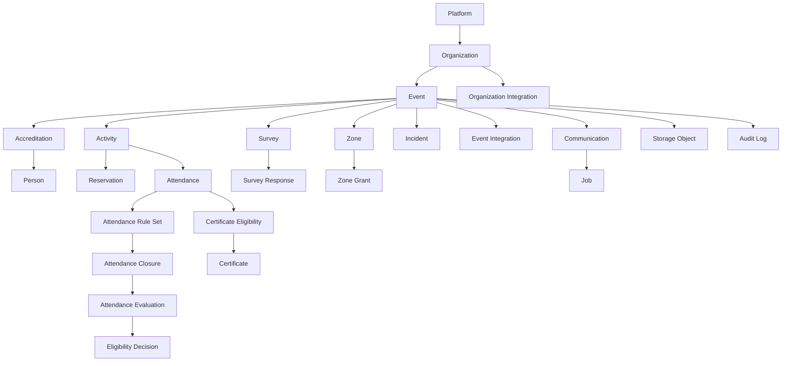

# BITORA V4 Conceptual Data Model

## Entidades Futuras Principales

| Entidad | Proposito | Tenant | Relaciones | Estados/Invariantes |
|---|---|---|---|---|
| attendance_session | Cierre y regla de asistencia | Evento/actividad | activity, accreditation | No duplicar por participante y actividad |
| certificate | Certificado emitido | Evento/persona | eligibility, storage | Codigo verificable unico |
| survey | Encuesta versionada | Evento/actividad | responses | Publicada no se edita destructivamente |
| survey_response | Respuesta | Encuesta/persona opcional | survey version | Anonima no reidentificable |
| speaker | Perfil disertante | Organizacion | activities | Publicacion requiere validacion |
| zone | Area fisica/logica | Evento | grants, access logs | Denegacion explicita prevalece |
| zone_grant | Permiso fisico | Evento/persona | zone, accreditation | Vigencia obligatoria |
| incident | Incidencia | Evento/org | comments, evidence | Comentarios append-only |
| automation_rule | Regla supervisada | Org/evento | jobs | Sin ciclos, owner obligatorio |
| report_snapshot | Corte de metricas | Org/evento | source tables | Version de calculo obligatoria |

## Retencion y Eliminacion

Datos personales deben admitir anonimizado. Auditoria y certificados revocados conservan trazabilidad minima. Storage se borra por politica y scope.
