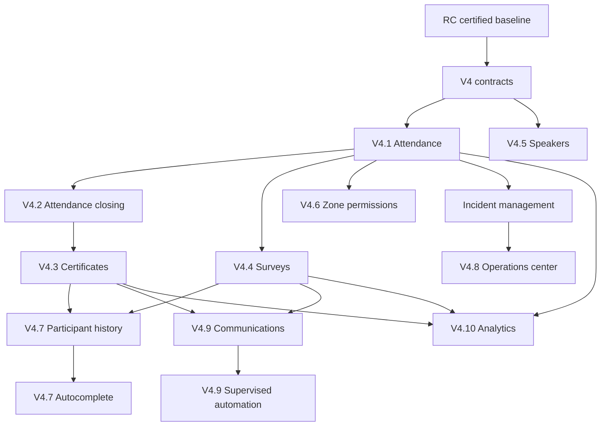

# BITORA V4 Dependency Graph

## Bloqueantes

Contratos de ownership, permisos y auditoria deben cerrarse antes de implementar entidades. Asistencia bloquea certificados, parte de analytics y parte del centro operativo.

## Paralelizables

Disertantes puede avanzar luego de contratos base. Encuestas puede avanzar en paralelo con certificados si comparte elegibilidad via contrato estable. Incidencias puede avanzar en paralelo con zonas si mantiene ownership evento.

## Dependencias Futuras

Migraciones: asistencia, certificados, encuestas, disertantes, zonas e incidencias.
Backend: servicios por dominio y repositorios.
UI: admin por modulo, portal participante, portal disertante y centro operativo.
Worker: certificados, comunicaciones, automatizaciones y report snapshots.
